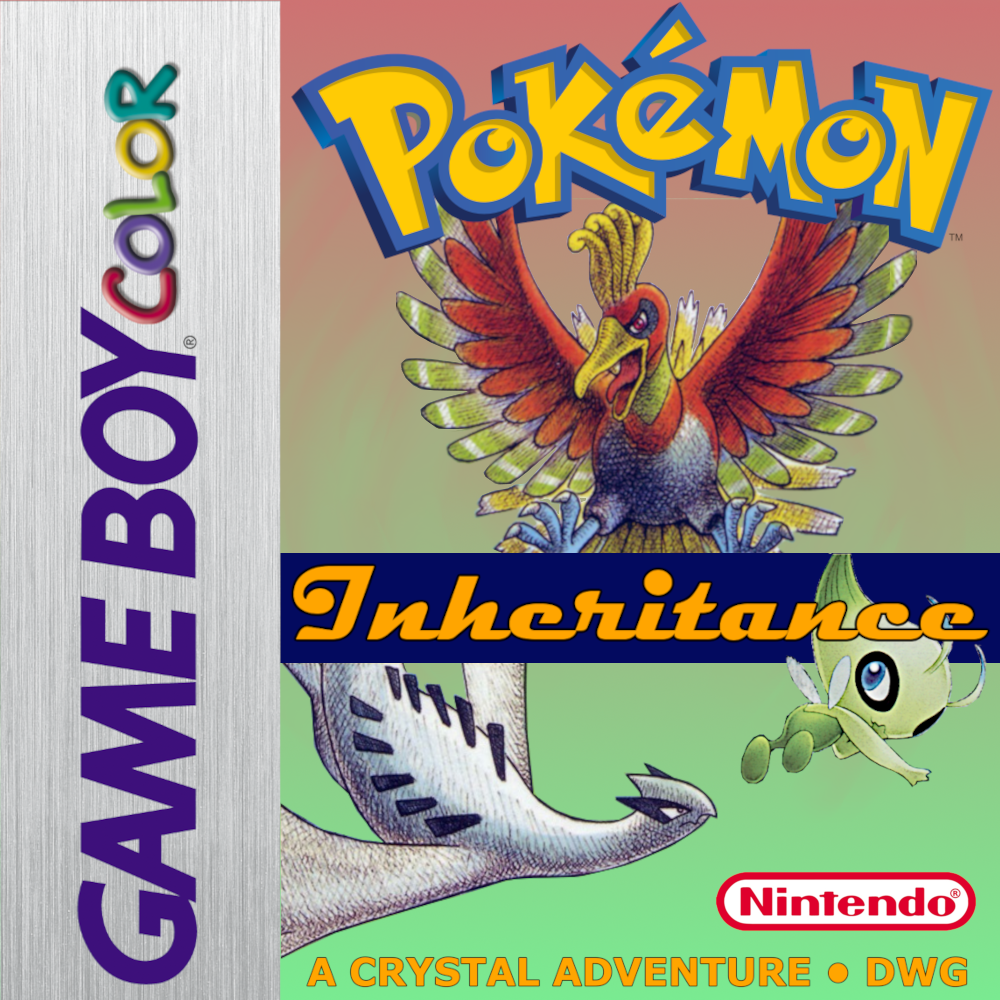

# Crystal Inheritance — Field Archive

An unofficial, fan-made **field archive & strategy reference** for
[**Crystal Inheritance**](https://github.com/dwg-and-dogs/PLC_Polished) v1.0.0 — a
Generation II Pokémon Crystal romhack built on *Polished Crystal* that re-imagines
Johto across two eras with modern mechanics.

### → Live site: https://welcome-to-nyc.github.io/Crystal-Inheritance-docs-/



## What's inside

| Section | Contents |
|---|---|
| **Pokédex** | All 285 catalogued forms — types, full level-up movesets, evolution lines, and where each one is found. Searchable by name/type/form. |
| **Wild Encounters** | Every location across **Modern Johto** & **Historic Johto** — grass, surf, fishing, headbutt & rock-smash groups, hidden grottoes, gift Pokémon, and the Kimono Cabin. |
| **Trainers** | Major trainers, rivals, and bosses across **Easy / Normal / Expert** difficulties — full teams with levels, held items, and movesets. |
| **Items** | Where to find every item, TM, HM, and move tutor. |
| **Credits** | The huge community behind Crystal Inheritance and Polished Crystal. |

## Design

A "crystal cartridge unearthed from an archive" — a dark, crystalline interface built
around the game's **time-duality** motif: <kbd>cyan</kbd> for Modern Johto, <kbd>amber</kbd>
for Historic Johto. Gem-cut panels, a pixel wordmark, and authentic **Gen II / GBC sprites**
wherever a species existed in 1999 (newer arrivals fall back to modern art).

## How it's built

A dependency-free static site — plain HTML/CSS/ES-modules, no build step. All game data
is parsed from the official Crystal Inheritance documentation into JSON by the scripts in
[`tools/`](tools/); sprites, national-dex numbers, and types come from
[PokeAPI](https://pokeapi.co) (Gen II Crystal sprites preferred).

```
index.html        shell
css/styles.css    design system
js/               router · data store · utilities · one module per view
data/*.json       parsed game data
sprites/          284 Pokémon sprites
tools/*.py        the parsers that generate data/ + sprites/
```

## Disclaimer

This is an unofficial fan project for documentation purposes. **Pokémon is ©
Nintendo / Creatures Inc. / GAME FREAK.** Crystal Inheritance is a fan romhack by
*dwg* and contributors; all game data and credits originate from the official
Crystal Inheritance documentation.
